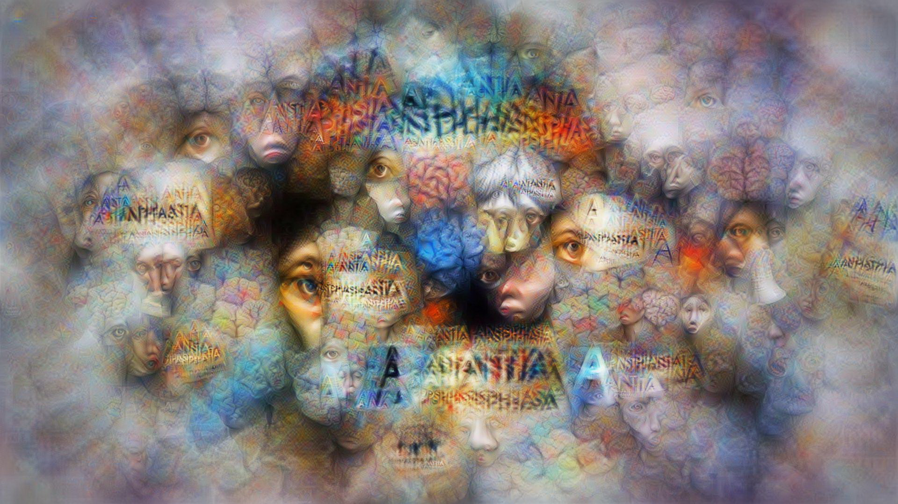
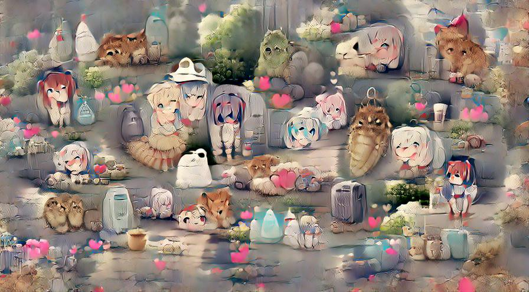
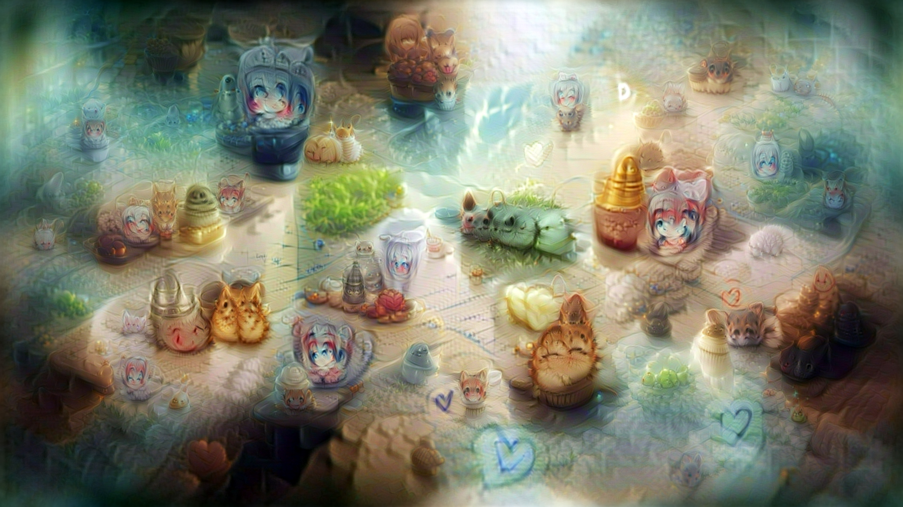

# Aphantasia

<p align='center'></p>

[](https://colab.research.google.com/github/eps696/aphantasia/blob/master/Aphantasia.ipynb)

This is a text-to-image tool, part of the [artwork] of the same name.   
Based on [CLIP] model, with FFT parameterizer from [Lucent] library as a generator.  
*Updated: Check also colabs below, with VQGAN and SIREN+FFM generators.*  
Tested on Python 3.7 with PyTorch 1.7.1 or 1.8.

*[Aphantasia] is the inability to visualize mental images, the deprivation of visual dreams.  
The image in the header is generated by the tool from this word.*

## Features
* generating massive detailed textures, a la deepdream
* fast convergence!
* fullHD/4K resolutions and above
* various CLIP models (including multi-language from [SBERT])
* complex queries:
	* text and/or image as main prompts
	* additional text prompts for fine details and to subtract (avoid) topics
	* criteria inversion (show "the opposite")
* continuous mode to process phrase lists (e.g. illustrating lyrics)
* saving/loading parameters to resume processing

Setup [CLIP] et cetera:
```
pip install -r requirements.txt
pip install git+https://github.com/openai/CLIP.git
```

## Operations

* Generate an image from the text prompt (set the size as you wish):
```
python clip_fft.py -t "the text" --size 1280-720
```
* Reproduce an image:
```
python clip_fft.py -i theimage.jpg --sync 0.4
```
If `--sync X` argument > 0, [LPIPS] loss is added to keep the composition similar to the original image. 

You can combine both text and image prompts.  
For non-English languages use either `--multilang` (multi-language CLIP model, trained with ViT) or `--translate` (Google translation, works with any visual model). 

* Set more specific query like this:
```
python clip_fft.py -t "topic sentence" -t2 "style description" -t0 "avoid this" --size 1280-720 
```
* Other options:  
`--model M` selects one of the released CLIP visual models: `ViT-B/32` (default), `RN50`, `RN50x4`, `RN101`.  
`--align XX` option is about composition (or sampling distribution, to be more precise): `uniform` is maybe the most adequate; `overscan` can make semi-seamless tileable textures.  
`--steps N` sets iterations count. 100-200 is enough for a starter; 500-1000 would elaborate it more thoroughly.  
`--samples N` sets amount of the image cuts (samples), processed at one step. With more samples you can set fewer iterations for similar result (and vice versa). 200/200 is a good guess. NB: GPU memory is mostly eaten by this count (not resolution)!  
`--decay X` (compositional softness), `--colors X` (saturation) and `--contrast X` may be useful, especially for ResNet models (they tend to burn the colors). 
`--sharp X` may be useful to increase sharpness, if the image becomes "myopic" after increasing `decay`. it affects the other color parameters, better tweak them all together! 
Current defaults are `--decay 1.5 --colors 1.5 --contrast 0.9 --sharp 0.2`.  
`--transform` applies some augmentations, inhibiting image fragmentation & "graffiti" printing (slower, yet recommended).  
`--invert` negates the whole criteria, if you fancy checking "totally opposite".  
`--save_pt myfile.pt` will save FFT parameters, to resume for next query with `--resume myfile.pt`.  
`--fstep N` tells to save every Nth frame (useful with high iterations, default is 1).  
`--verbose` ('on' by default) enables some printouts and realtime image preview.  
* Some experimental tricks with less definite effects:  
`--enhance X` boosts training consistency (of simultaneous samples) and overall progress. good start is ~0.2.  
`--notext X` tries to remove "graffiti" by subtracting plotted text prompt. good start is ~0.1.  
`--noise X` adds some noise to the parameters, possibly making composition less clogged (in a degree).  
`--macro X` (from 0 to 1) shifts generation to bigger forms and less disperse composition. should not be too close to 1, since the quality depends on the variety of samples.  
`--prog` sets progressive learning rate (from 0.1x to 2x of the one, set by `lrate`). it may boost macro forms creation in some cases (see more [here](https://github.com/eps696/aphantasia/issues/2)).  
`--lrate` controls learning rate. The range is quite wide (tested at least within 0.001 to 10).  

## Continuous mode 
[](https://colab.research.google.com/github/eps696/aphantasia/blob/master/Illustra.ipynb)

* Make video from a text file, processing it line by line in one shot:
```
python illustra.py -i mysong.txt --size 1280-720 --length 155
```
This will first generate and save images for every text line (with sequences and training videos, as in single-image mode above), then render final video from those (mixing images in FFT space) of the `length` duration in seconds.  

There is `--keep X` parameter, controlling how well the next line/image generation follows the previous. By default X = 0, and every frame is produced independently (i.e. randomly initiated). 
Setting it higher starts each generation closer to the average of previous runs, effectively keeping the compositions more similar and the transitions smoother. Safe values are < 0.5 (higher numbers may cause the imagery getting stuck). This behaviour depends on the input, so test with your prompts and see what's better in your case.

* Make video from a directory with saved *.pt snapshots (just interpolate them):
```
python interpol.py -i mydir --length 155
```

## Other generators

* VQGAN from [Taming Transformers](https://github.com/CompVis/taming-transformers)  
One of the best methods for colors/tones/details (especially with new Gumbel-F8 model); has quite limited resolution though (~800x600 max on Colab).  
[](https://colab.research.google.com/github/eps696/aphantasia/blob/master/CLIP_VQGAN.ipynb) 
<p></p>

* SIREN + [Fourier feature modulation](https://github.com/tancik/fourier-feature-networks)  
One of the first methods, not so interesting these days.  
[](https://colab.research.google.com/drive/1L14q4To5rMK8q2E6whOibQBnPnVbRJ_7)  
<p></p>

## Credits

Based on [CLIP] model by OpenAI, [the paper]  
Used FFT encoding from [Lucent] library

Thanks to [Ryan Murdock], [Jonathan Fly], [Hannu Toyryla], [@eduwatch2], [torridgristle] for ideas.

<p align='center'></p>

[artwork]: <https://computervisionart.com/pieces2021/aphantasia>
[Aphantasia]: <https://en.wikipedia.org/wiki/Aphantasia>
[CLIP]: <https://openai.com/blog/clip>
[SBERT]: <https://sbert.net>
[Lucent]: <https://github.com/greentfrapp/lucent>
[LPIPS]: <https://github.com/richzhang/PerceptualSimilarity>
[Taming Transformers]: <https://github.com/CompVis/taming-transformers>
[Ryan Murdock]: <https://twitter.com/advadnoun>
[Jonathan Fly]: <https://twitter.com/jonathanfly>
[Hannu Toyryla]: <https://twitter.com/htoyryla>
[@eduwatch2]: <https://twitter.com/eduwatch2>
[torridgristle]: <https://github.com/torridgristle>
[the paper]: <https://arxiv.org/abs/2103.00020>
