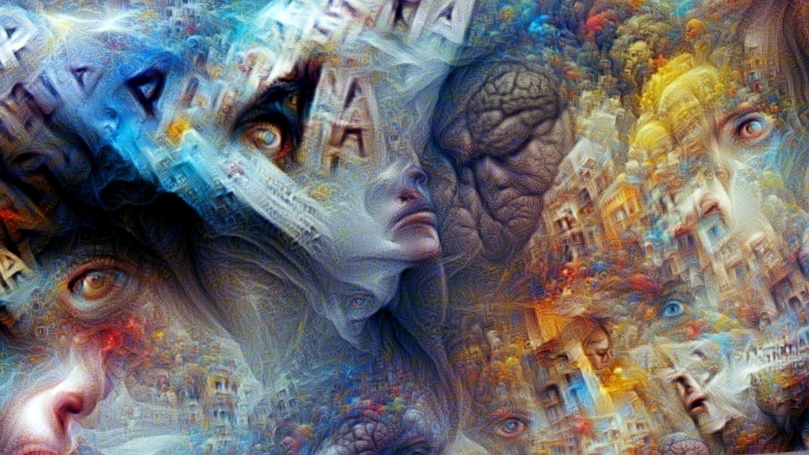

# Aphantasia

<p align='center'></p>

This is a collection of text-to-image tools, evolved from the [artwork] of the same name.   
Based on [CLIP] model and [Lucent] library, with FFT/DWT/RGB parameterizers (no-GAN generation).  
*Updated: **Illustrip** (text-to-video with motion and depth) is added.*  
*Updated: DWT (wavelets) parameterization is added.*  
*Updated: Check also colabs below, with VQGAN and SIREN+FFM generators.*  
Tested on Python 3.7 with PyTorch 1.7.1 or 1.8.

*[Aphantasia] is the inability to visualize mental images, the deprivation of visual dreams.  
The image in the header is generated by the tool from this word.*

**Please be kind to mention this project, if you employ it for your masterpieces**

## Features
* generating massive detailed textures, a la deepdream
* fullHD/4K resolutions and above
* various CLIP models (including multi-language from [SBERT])
* continuous mode to process phrase lists (e.g. illustrating lyrics)
	* pan/zoom motion with smooth interpolation
	* direct RGB pixels optimization (very stable)
	* depth-based 3D look (courtesy of [deKxi], based on [AdaBins])
* complex queries:
	* text and/or image as main prompts
	* separate text prompts for style and to subtract (avoid) topics
	* starting/resuming process from saved parameters or from an image

Setup [CLIP] et cetera:
```
pip install -r requirements.txt
pip install git+https://github.com/openai/CLIP.git
```

## Operations

[](https://colab.research.google.com/github/eps696/aphantasia/blob/master/Aphantasia.ipynb)

* Generate an image from the text prompt (set the size as you wish):
```
python clip_fft.py -t "the text" --size 1280-720
```
* Reproduce an image:
```
python clip_fft.py -i theimage.jpg --sync 0.4
```
If `--sync X` argument > 0, [LPIPS] loss is added to keep the composition similar to the original image. 

You can combine both text and image prompts.  
For non-English languages use either `--multilang` (multi-language CLIP model, trained with ViT) or `--translate` (Google translation, works with any visual model). 

* Set more specific query like this:
```
python clip_fft.py -t "topic sentence" -t2 "style description" -t0 "avoid this" --size 1280-720 
```
* Other options:  
Text inputs understand syntax with weights, like `good prompt :1 | also good prompt :1 | bad prompt :-0.5`.  
`--model M` selects one of the released CLIP visual models: `ViT-B/32` (default), `ViT-B/16`, `RN50`, `RN50x4`, `RN50x16`, `RN101`.  
One can also set `--dualmod` to use `ViT-B/32` and `ViT-B/16` at once (preferrable).  
`--dwt` switches to DWT (wavelets) generator instead of FFT. There are few methods, chosen by `--wave X`, e.g. `db2`, `db3`, `coif1`, `coif2`, etc.  
`--align XX` option is about composition (or sampling distribution, to be more precise): `uniform` is maybe the most adequate; `overscan` can make semi-seamless tileable textures.  
`--steps N` sets iterations count. 100-200 is enough for a starter; 500-1000 would elaborate it more thoroughly.  
`--samples N` sets amount of the image cuts (samples), processed at one step. With more samples you can set fewer iterations for similar result (and vice versa). 200/200 is a good guess. NB: GPU memory is mostly eaten by this count (not resolution)!  
`--aest X` enforces overall cuteness by employing [aesthetic loss](https://github.com/LAION-AI/aesthetic-predictor). try various values (may be negative).  
`--decay X` (compositional softness), `--colors X` (saturation) and `--contrast X` may be useful, especially for ResNet models (they tend to burn the colors). 
`--sharp X` may be useful to increase sharpness, if the image becomes "myopic" after increasing `decay`. it affects the other color parameters, better tweak them all together! 
Current defaults are `--decay 1.5 --colors 1.8 --contrast 1.1 --sharp 0`.  
`--transform X` applies some augmentations, usually enhancing result (but slower). there are few choices; `fast` seems optimal.  
`--optimizer` can be `adam`, `adamw`, `adam_custom` or `adamw_custom`. Custom options are noiser but stable; pure `adam` is softer, but may tend to colored blurring.  
`--invert` negates the whole criteria, if you fancy checking "totally opposite".  
`--save_pt myfile.pt` will save FFT/DWT parameters, to resume for next query with `--resume myfile.pt`. One can also start/resume directly from an image file.  
`--opt_step N` tells to save every Nth frame (useful with high iterations, default is 1).  
`--verbose` ('on' by default) enables some printouts and realtime image preview.  
* Some experimental tricks with less definite effects:  
`--enforce X` adds more details by boosting similarity between two parallel samples. good start is ~0.1.  
`--expand X` boosts diversity by enforcing difference between prev/next samples. good start is ~0.3.  
`--noise X` adds some noise to the parameters, possibly making composition less clogged (in a degree).  
`--macro X` (from 0 to 1) shifts generation to bigger forms and less disperse composition. should not be too close to 1, since the quality depends on the variety of samples.  
`--prog` sets progressive learning rate (from 0.1x to 2x of the one, set by `lrate`). it may boost macro forms creation in some cases (see more [here](https://github.com/eps696/aphantasia/issues/2)).  
`--lrate` controls learning rate. The range is quite wide (tested at least within 0.001 to 10).  

## Text-to-video [continuous mode]

Here is two ways of making video from the text file(s), processing it line by line in one shot.

### Illustrip

New method, interpolating topics as a constant flow with permanent pan/zoom motion and optional 3D look.  

[](https://colab.research.google.com/github/eps696/aphantasia/blob/master/IllusTrip3D.ipynb)

* Make video from two text files, processing them line by line, rendering 100 frames per line:
```
python illustrip.py --in_txt mycontent.txt --in_txt2 mystyles.txt --size 1280-720 --steps 100
```
* Make video from two phrases, with total length 500 frames:
```
python illustrip.py --in_txt "my super content" --in_txt2 "my super style" --size 1280-720 --steps 500
```
Prefixes (`-pre`), postfixes (`-post`) and "stop words" (`--in_txt0`) may be loaded as phrases or text files as well.  
All text inputs understand syntax with weights, like `good prompt :1 | also good prompt :1 | bad prompt :-0.5` (within one line).  
One can also use image(s) as references with `--in_img` argument. Explore other arguments for more explicit control.  
This method works best with direct RGB pixels optimization, but can also be used with FFT parameterization:
```
python illustrip.py ... --gen FFT --smooth --align uniform --colors 1.8 --contrast 1.1
```

To add 3D look, download [AdaBins model] to the main directory, and add `--depth 0.01` to the command.

### Illustra 

Generates separate images for every text line (with sequences and training videos, as in single-image mode above), then renders final video from those (mixing images in FFT space) of the `length` duration in seconds.  

[](https://colab.research.google.com/github/eps696/aphantasia/blob/master/Illustra.ipynb)

* Make video from a text file, processing it line by line:
```
python illustra.py -t mysong.txt --size 1280-720 --length 155
```
There is `--keep X` parameter, controlling how well the next line/image generation follows the previous. 0 means it's randomly initiated, the higher - the stricter it will keep the original composition. Safe values are 1~2 (much higher numbers may cause the imagery getting stuck). 

* Make video from a directory with saved *.pt snapshots (just interpolate them):
```
python interpol.py -i mydir --length 155
```

## Other generators

* VQGAN from [Taming Transformers](https://github.com/CompVis/taming-transformers)  
One of the best methods for colors/tones/details (especially with new Gumbel-F8 model); has quite limited resolution though (~800x600 max on Colab).  
[](https://colab.research.google.com/github/eps696/aphantasia/blob/master/CLIP_VQGAN.ipynb) 
* Continuous mode with VQGAN (analog of Illustra)  
[](https://colab.research.google.com/drive/1H7vHyS6mRU7gW59lfi2Qa6M-RXKIJ8Si)
<p></p>

* CPPN + [export to HLSL shaders](https://github.com/wxs/cppn-to-glsl)  
One of the very first methods, with exports for TouchDesigner, vvvv, Shadertoy, etc.  
[](https://colab.research.google.com/drive/1Kbbbwoet3igHPJ4KpNh8z3V-RxtstAcz)  
```
python cppn.py -v -t "the text" --aest 0.5
```

* SIREN + [Fourier feature modulation](https://github.com/tancik/fourier-feature-networks)  
Another early method, not so interesting on its own.  
[](https://colab.research.google.com/drive/1L14q4To5rMK8q2E6whOibQBnPnVbRJ_7)  
<p></p>

## Credits

Based on [CLIP] model by OpenAI ([paper]).  
FFT encoding is taken from [Lucent] library, 3D depth processing made by [deKxi].

Thanks to [Ryan Murdock], [Jonathan Fly], [Hannu Toyryla], [@eduwatch2], [torridgristle] for ideas.

<p align='center'></p>

[artwork]: <https://computervisionart.com/pieces2021/aphantasia>
[Aphantasia]: <https://en.wikipedia.org/wiki/Aphantasia>
[CLIP]: <https://openai.com/blog/clip>
[SBERT]: <https://sbert.net>
[Lucent]: <https://github.com/greentfrapp/lucent>
[AdaBins]: <https://github.com/shariqfarooq123/AdaBins>
[AdaBins model]: <https://drive.google.com/file/d/1lvyZZbC9NLcS8a__YPcUP7rDiIpbRpoF>
[LPIPS]: <https://github.com/richzhang/PerceptualSimilarity>
[Taming Transformers]: <https://github.com/CompVis/taming-transformers>
[Ryan Murdock]: <https://twitter.com/advadnoun>
[Jonathan Fly]: <https://twitter.com/jonathanfly>
[Hannu Toyryla]: <https://twitter.com/htoyryla>
[@eduwatch2]: <https://twitter.com/eduwatch2>
[torridgristle]: <https://github.com/torridgristle>
[deKxi]: <https://twitter.com/deKxi>
[paper]: <https://arxiv.org/abs/2103.00020>
